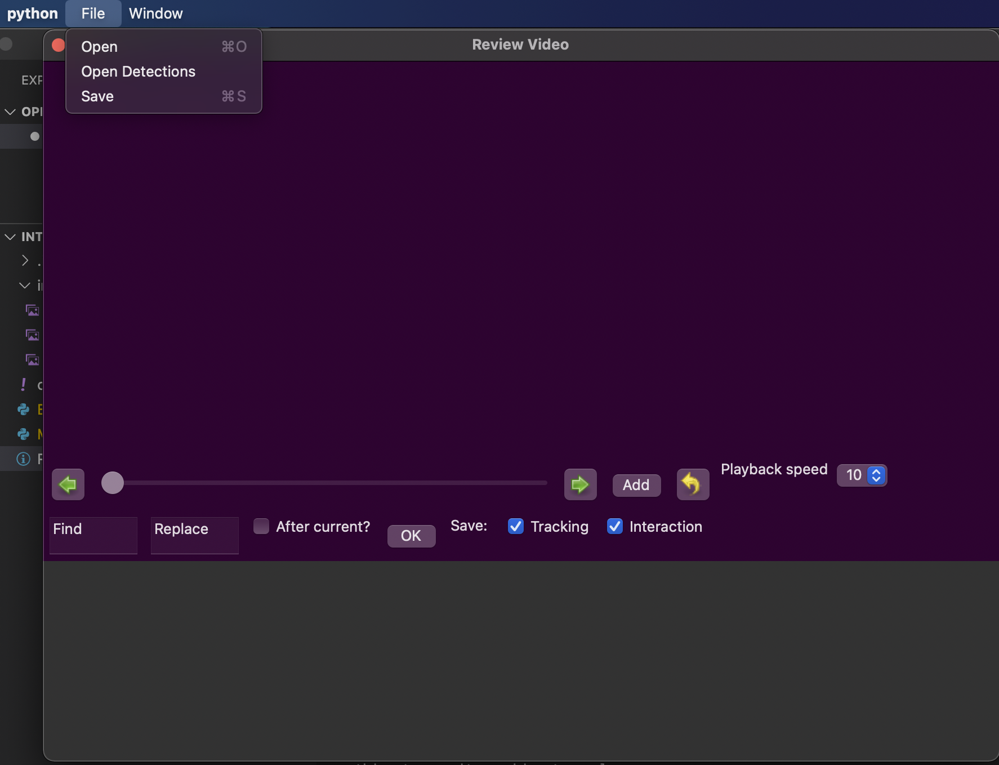
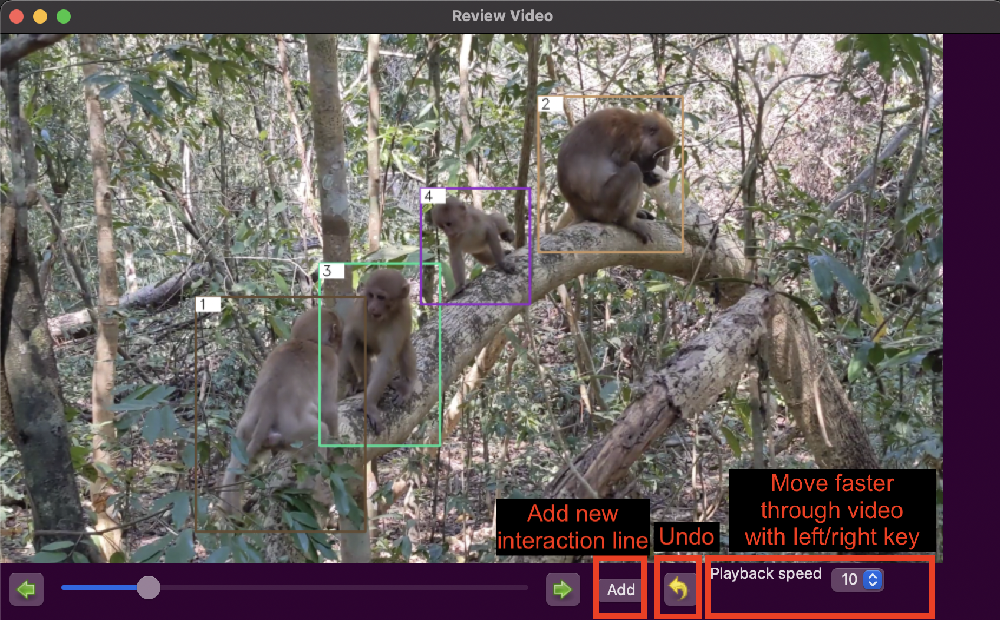
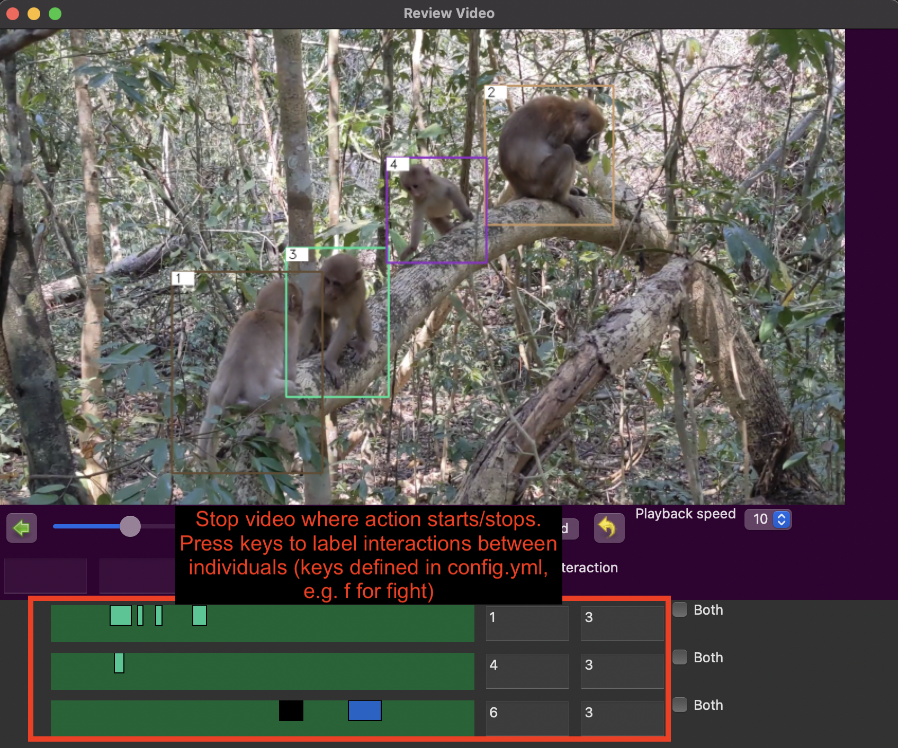
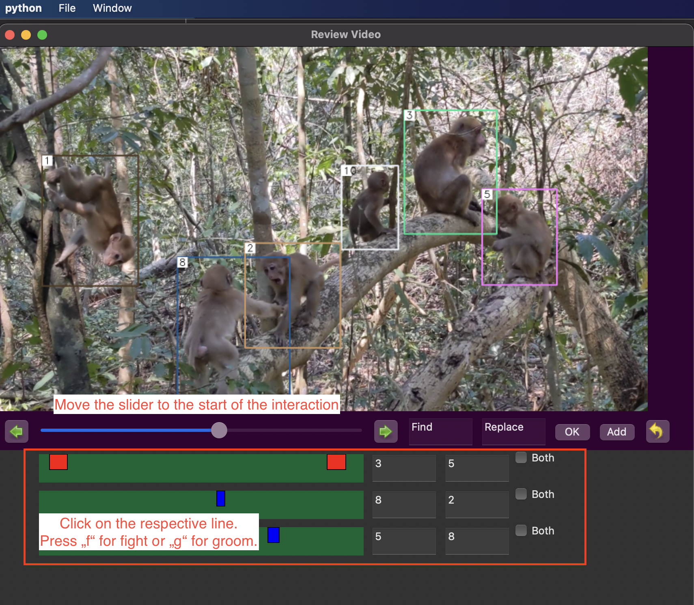

# Packages

You will need to install opencv and wxPython, e.g. by running `pip install opencv-python` and `pip install wxpython`.

The code for the Interaction Labelling Tool is in MonkeyApp.py. 
The code for the Tool for Extraction of Frames is in ExtractFramesApp.py. 
Run the file and the app should open. (For Mac you might need to call `pythonw MonkeyApp.py` instead of `python MonkeyApp.py`).

# interaction-labelling-tool

## Data Structure

Inside the folder with your data, you will need to have a folder called `predictions`. It contains one folder for each Video (with the same name as the video) containing `results.txt` which are simulatenously loaded with the video.
Additionally, create three folders called `tracking_updated`, `interactions`, and `log`, which are empty for now.

```
datafolder
   |——————predictions
   |        └——————VID_01.mp4
   |                    └——————results.txt
   |        └——————VID_02.mp4
   |                    └——————results.txt
   |------tracking_updated
   |------interactions
   |------log
   └------VID_01.mp4
   └------VID_02.mp4
```


### Open a new Video

You can open a video with the associated tracking file from the predictions folder.
Afterwards you can open other tracking files (maybe one you already worked on before) with Menu > Open Detections.



### Navigate through video

You can either use the buttons or the left/right key on your keyboard (this only works after you clicked on the video or the purple area).

Caution that the playback speed skips frames (unless you choose speed 1).



### Check the tracking labels

You can replace one label by another one.
If you want to remove a label, put "-" to the second box.
If you don't know which is the next available label, put "?" in the second box.
You have the option to replace the label in all frames or only after a certain frame.



### Add interaction labels



### Save labels

Select if you wish to save updated tracking results and/or labelled interactions. Then select your image folder, all files will be saved automatically in folder/updated_tracking, folder/interactions and folder/log.


# Get Frames / Frames-Pairs from Videos

This Mini-App helps to quickly extract frames or frame pairs from a video. 

You manually have to change the output_path in the MainFrame class.

## Extract frames
Open a video. If you find a frame you would like to extract for Labelling, press Select.
If you want to label a second frame (which comes a few frames after the first frame), navigate there and press Select2. The files will be saved in the format "img_00000_1.jpg" and "img_00000_2.jpg". When you hit Select again, it will be saved as "img_00001_1.jpg". 

## Don't overwrite previous labels
If you already collected data (let's say until img_00153_2.jpg"), make sure to put the number in the first box to 154 and click OK when reopening the app, so that it knows where to continue counting (otherwise it will overwrite the first images).

## Playback speed
If you want to browse through the video, you can use the slider or the left/right keys. You can change how fast you run through the video by changing the number on the left of the slider (be aware that this skips frames).