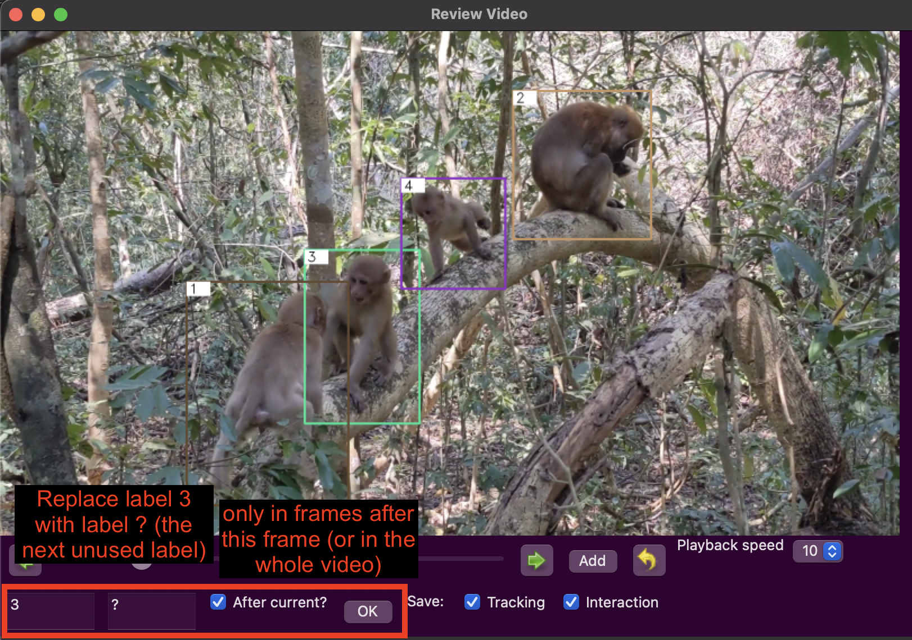

# interaction-labelling-tool


## Data Structure

Inside the folder with your data, you will need to have a folder called `predictions`. It contains one folder for each Video (with the same name as the video) containing `results.txt` which are simulatenously loaded with the video.

```
datafolder
   |——————predictions
   |        └——————VID_01.mp4
   |                    └——————results.txt
   |        └——————VID_02.mp4
   |                    └——————results.txt
   └------VID_01.mp4
   └------VID_02.mp4
```

## Packages

You will need to install opencv and wxPython, e.g. by running `pip install opencv-python` and `pip install wxpython`.

The code is in MonkeyApp.py. Run the file and the app should open.


### Open a new Video


### Check the tracking labels


### Add interaction labels



### Save labels

- File > SaveDetections: Saves updated tracking results (if you change any labels)
- File > SaveInteractions: Saves labelled interactions in a text file.

